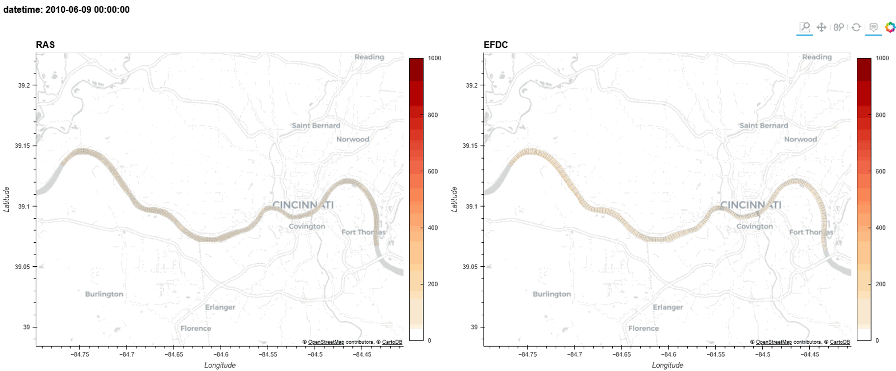
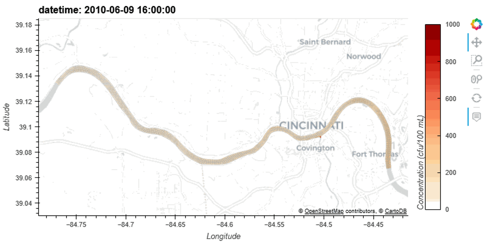

# ClearWater-Riverine
ClearWater-Riverine is a two-dimensional (2D) water quality model for complex river systems and floodplains. It is developed by the Environmental Laboratory, U.S Army Engineer Research and Development Center (ERDC). The intent of this model is to simulate the transport (advection and diffusion) of heat and water quality constituents in riverine systems by integrating it with ERDC's ClearWater (Corps Library for Environmental Analysis and Restoration of Watersheds modules. 

The current version of ClearWater-Riverine simulates generalized conservative constituent transport. Ongoing development is extending these capabilities to simulate fundamental eutrophication processes such as the interactions between temperature, nutrients, algae, dissolved oxygen, organic matter, and sediment diagenesis. ClearWater-Riverine assumes vertical homogeneity. Therefore, it is best suited for evaluating riverine systems during conditions where vertical stratification does not contribute significantly to the water quality dynamics, but where the longitudinal and lateral changes of water quality are important.

## Example applications

The following plot shows an animation of E. Coli transport in the Ohio River. A sudden inflow of E. Coli enters the Ohio River at Covington on the south shore of the river. The downstream flow and lateral spread of E. Coli over time is due to the transport and mixing processes (advection-diffusion) in the river. 



ClearWater-Riverine performance was compared to an existing EFDC model of the Ohio River, and both models were verified with observed data. These comparisons verified that ClearWater-Riverine is accurately capaturing the transport processes in this system. A side-by-side comparison of the two models is shown below.



## Repository Directories

**[src](src)** contains the source code to create and run the clearwater_riverine.

**[examples](examples)** contains tutorials and useful Juptyer Notebooks.

**[docs](docs)** contains relevant reference documentation.

**[tests](tests)** will contain clearwater_riverine tests once they are developed. 

## Installation

Clearwater Riverine is designed to run with **Python 3.10**. 

Follow these steps to install.

#### 1. Install the Anaconda Python Distribution

We recommend installing the [latest release](https://docs.anaconda.com/anaconda/reference/release-notes/) of [**Anaconda Individual Edition**](https://www.anaconda.com/distribution). Follow their [installation](https://docs.anaconda.com/anaconda/install/) documentation.

#### 2. Clone or Download this Clearwater-riverine repository

From this Github site, click on the green "Code" dropdown button near the upper right. Select to either Open in GitHub Desktop (i.e. git clone) or "Download ZIP". We recommend using GitHub Desktop, to most easily receive updates.

Place your copy of the Clearwater-riverine folder in any convenient location on your computer.

#### 3. Create a Conda Environment for Clearwater Riverine Modeling 

We have provided an [`environment.yml`](environment.yml) file, which lists all primary dependencies, to help. Create a `clearwater_riverine` environment either with the **Import** button on [Anaconda Navigator's Environments tab](https://docs.anaconda.com/anaconda/navigator/overview/#environments-tab), or use this [Conda](https://conda.io/docs/) command in your terminal or console,  replacing `path/environment.yml` with the full file pathway to the `environment.yml` file in the local cloned repository.

```shell
conda env create --file path/environment.yml
```
To update your environment, either use Anaconda Navigator, or run the following command:

```shell
conda env update --file path/environment.yml --prune
```

or

```shell
conda env create --file path/environment.yml --force
```


#### 4. Add your Clearwater Riverine Path to Anaconda sites-packages

To have access to the `clearwater_riverine` module in your Python environments,
it is necessary to have a path to your copy of Clearwater Riverine in Anaconda's `sites-packages` directory (i.e. something like `$HOME/path/to/anaconda/lib/pythonX.X/site-packages` or `$HOME/path/to/anaconda/lib/site-packages` similar).

The easiest way to do this is to use the [conda develop](https://docs.conda.io/projects/conda-build/en/latest/resources/commands/conda-develop.html) command in the console or terminal like this, replacing `/path/to/module/` with the full file pathway to the local cloned Clearwater-riverine repository:

```console
conda-develop /path/to/module/
```

You should now be able to run the examples and create your own Jupyter Notebooks!


## Getting Started

We recommend viewing or interactively running our [Ohio River](examples/Ohio%20River.ipynb) Jupyter Notebook.

We recommend using [JupyterLab](https://jupyterlab.readthedocs.io/en/stable/) to run our tutorial [Juptyer Notebooks](https://jupyter.org/index.html) in the [example](examples) folder, due to many additional built-in features and extensions. The following JupyterLab [extensions](https://jupyterlab.readthedocs.io/en/stable/user/extensions.html) are particularly useful:
- [lckr-jupyterlab-variableinspector](https://github.com/lckr/jupyterlab-variableInspector)
