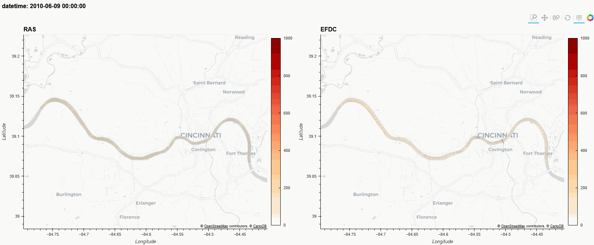
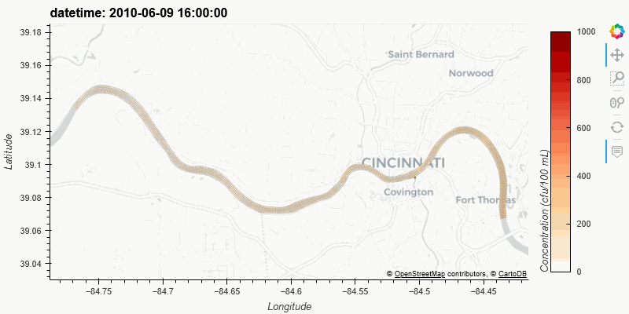

# ClearWater-Riverine
ClearWater-Riverine is a two-dimensional (2D) water quality model for complex river systems and floodplains. It is developed by the Environmental Laboratory, U.S Army Engineer Research and Development Center (ERDC). The intent of this model is to simulate the transport (advection and diffusion) of heat and water quality constituents in riverine systems by integrating it with ERDC's ClearWater (Corps Library for Environmental Analysis and Restoration of Watersheds modules. 

The current version of ClearWater-Riverine simulates generalized conservative constituent transport. Ongoing development is extending these capabilities to simulate fundamental eutrophication processes such as the interactions between temperature, nutrients, algae, dissolved oxygen, organic matter, and sediment diagenesis. ClearWater-Riverine assumes vertical homogeneity. Therefore, it is best suited for evaluating riverine systems during conditions where vertical stratification does not contribute significantly to the water quality dynamics, but where the longitudinal and lateral changes of water quality are important.

## Example applications

The following plot shows an animation of E. Coli transport in the Ohio River in June, 2010. A sudden inflow of E. Coli enters the Ohio River at Covington on the south shore of the river. The downstream flow and lateral spread of E. Coli over time is due to the transport and mixing processes (advection-diffusion) in the river. 



ClearWater-Riverine performance was compared to an existing EFDC model of the Ohio River, and both models were verified with observed data. These comparisons verified that ClearWater-Riverine is accurately capaturing the transport processes in this system. A side-by-side comparison of the two models is shown below.



## Repository Directories

**[src](src)** contains the source code to create and run the clearwater_riverine.

**[examples](examples)** contains tutorials and useful Juptyer Notebooks.

**[docs](docs)** contains relevant reference documentation.

**[tests](tests)** will contain clearwater_riverine tests once they are developed. 

# Getting Started

## Installation

Clearwater Riverine is designed to run with **Python 3.10**. 

Follow these steps to install.

#### 1. Install Miniconda or Anaconda Distribution

We recommend installing the light-weight [Miniconda](https://docs.conda.io/projects/miniconda/en/latest/) that includes Python, the [conda](https://conda.io/docs/) environment and package management system, and their dependencies.

NOTE: Follow conda defaults to install in your local user director. DO NOT install for all users, to avoid substantial headaches with permissions.

If you have already installed the [**Anaconda Distribution**](https://www.anaconda.com/download), you can use it to complete the next steps, but you may need to [update to the latest version](https://docs.anaconda.com/free/anaconda/install/update-version/).

#### 2. Clone or Download this `Clearwater-riverine` repository

From this Github site, click on the green "Code" dropdown button near the upper right. Select to either Open in GitHub Desktop (i.e. git clone) or "Download ZIP". We recommend using GitHub Desktop, to most easily receive updates.

Place your copy of this repo folder in any convenient location on your computer.

#### 3. Create a Conda Environment for Clearwater Riverine Modeling 

We recommend creating a custom virtual environment with the [Conda](https://conda.io/docs/) package, dependency, and environment management for any language (i.e. easily install C++ packages such as GDAL).

We provide an [`environment.yml`](environment.yml) file that specifies for [Conda](https://conda.io/docs/) how to create a virtual environment that contains the same software dependencies that we've used in development and testing.

Create a `ClearWater-modules` environment using this [conda](https://conda.io/docs/) command in your terminal or Anaconda Prompt console. If necessary, replace `environment.yml` with the full file pathway to the `environment.yml` file in the local cloned repository.

```shell
conda env create --file environment.yml
```

Alternatively, use the faster [`libmamba` solver](https://conda.github.io/conda-libmamba-solver/getting-started/) with:

```shell
conda env create -f environment.yml --solver=libmamba
```

If users are experiencing issues with plots NOT displaying in jupyter notebooks once a cell is executed, then we recommend using the `environment_working.yml` file. We have noticed that later versions of some libraries might be creating a conflict, but we have not been able to track down the root cause since no warnings/errors are given when the plot does NOT display:

```shell
conda env create -f environment_working.yml --solver=libmamba
```

Activate the environment using the instructions printed by conda after the environment is created successfully.

To update your environment to the latest versions of dependencies and/or add additional dependencies to your environment (by first editting [`environment.yml`](environment.yml)), run the following command:

```shell
conda env update -f environment.yml --solver=libmamba --prune
```

or to recreate from scratch:

```shell
conda env create -f environment.yml --solver=libmamba --force
```

For additional information on managing conda environments, see [Conda's User Guide on Managing Environments](https://docs.conda.io/projects/conda/en/stable/user-guide/tasks/manage-environments.html).

#### 4. Add your `ClearWater-riverine` Path to Miniconda/Anaconda sites-packages

To have access to the `clearwater_riverine` module in your Python environments, it is necessary to have a path to your copy of Clearwater Riverine in Anaconda's `sites-packages` directory (i.e. something like `$HOME/path/to/anaconda/lib/pythonX.X/site-packages` or `$HOME/path/to/anaconda/lib/site-packages` similar).

The easiest way to do this is to use the [`conda develop`](https://docs.conda.io/projects/conda-build/en/latest/resources/commands/conda-develop.html) command in the console or terminal like this, replacing '/path/to/module/src' with the full file pathway to the local cloned Clearwater-riverine repository:

```console
conda develop '/path/to/module/src'
```

You should now be able to run the examples and create your own Jupyter Notebooks!


## Examples

We recommend viewing or interactively running our [Ohio River](examples/Ohio%20River.ipynb) Jupyter Notebook.

We recommend using [JupyterLab](https://jupyterlab.readthedocs.io/en/stable/) to run our tutorial [Juptyer Notebooks](https://jupyter.org/index.html) in the [example](examples) folder, due to many additional built-in features and extensions. The following JupyterLab [extensions](https://jupyterlab.readthedocs.io/en/stable/user/extensions.html) are particularly useful:
- [lckr-jupyterlab-variableinspector](https://github.com/lckr/jupyterlab-variableInspector)

# Contributing


# Acknowlgements

This library is developed by ERDC-EL through funding from the ECOMOD project.
Dr. Todd E. Steissberg (ERDC-EL) developed the vision for this library as an example of how to couple at water transport model with a water quality reaction model :

