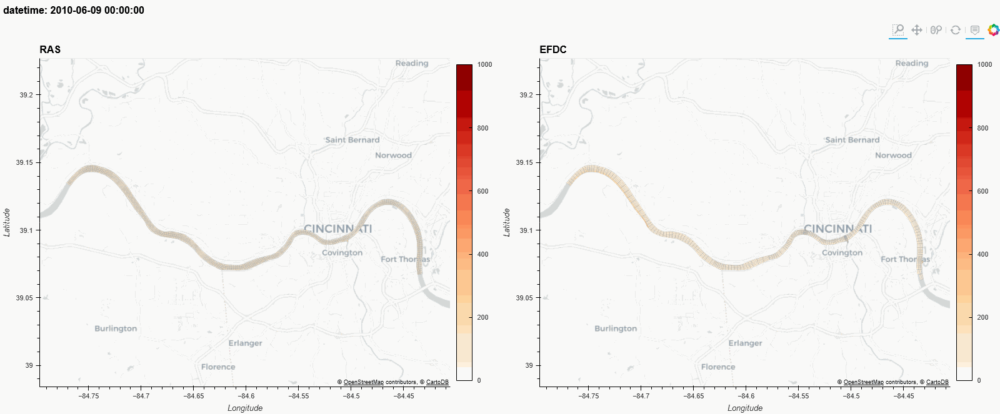
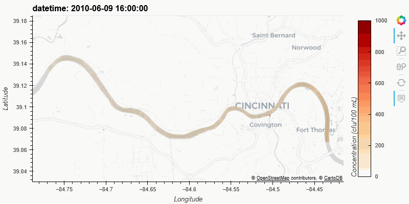

# ClearWater-Riverine

The [ClearWater-riverine]([url](https://github.com/EcohydrologyTeam/ClearWater-riverine)) package is a two-dimensional (2D) water quality transporter model to calculate conservative advection and diffusion of constituents from an unstructured grid of flows within complex river systems and floodplains. It is developed with modern Python by the the [U.S. Army Engineer Research and Development Center (ERDC)](https://www.erdc.usace.army.mil), [Environmental Laboratory (EL)](https://www.erdc.usace.army.mil/Locations/EL/). 

The goal of this model is to simulate the transport (advection and diffusion) of heat and water quality constituents in riverine systems by coupling it to ERDC's [ClearWater (Corps Library for Environmental Analysis and Restoration of Watersheds) modules](https://github.com/EcohydrologyTeam/ClearWater-modules) that simulates water quality processes and kinetics. At present, the Temperature Simulation Module (TSM) and Nutrient Simulation Module (NSM) have been successfully coupled to HEC-RAS-2D models via ClearWater-Riverine, simulating fundamental eutrophication processes such as the interactions between temperature, nutrients, algae, dissolved oxygen, and organic matter. ClearWater-Riverine assumes vertical homogeneity. Therefore, it is best suited for evaluating riverine systems during conditions where vertical stratification does not contribute significantly to the water quality dynamics, but where the longitudinal and lateral changes of water quality are important.

A secondary goal is to develop a suite of easy-to-use modern Python tools that build on community-developed scientific workflows, standards, and libraries to automate model setup, prepare input datasets, store output data, and visualize results using Python-based user interfaces such as Jupyter Notebooks.

## Example applications

The following plot shows an animation of E. Coli transport in the Ohio River in June, 2010. A sudden inflow of E. Coli enters the Ohio River at Covington on the south shore of the river. The downstream flow and lateral spread of E. Coli over time is due to the transport and mixing processes (advection-diffusion) in the river. 



ClearWater-Riverine performance was compared to an existing EFDC model of the Ohio River, and both models were verified with observed data. These comparisons verified that ClearWater-Riverine is accurately capaturing the transport processes in this system. A side-by-side comparison of the two models is shown below.



## Repository Directories

**[src](src)** contains the source code to create and run the clearwater_riverine.

**[examples](examples)** contains tutorials and useful Juptyer Notebooks.

**[docs](docs)** contains relevant reference documentation.

**[tests](tests)** will contain clearwater_riverine tests once they are developed. 

# Getting Started

## Installation

Clearwater Riverine is designed to run with **Python 3.10**. 

Follow these steps to install.

#### 1. Pixi

We recommend installing [pixi](https://pixi.prefix.dev/latest/), a fast, modern, and reproducible package managment tool. 

#### 2. Clone or Download this `Clearwater-riverine` repository

From this Github site, click on the green "Code" dropdown button near the upper right. Select to either Open in GitHub Desktop (i.e. git clone) or "Download ZIP". We recommend using GitHub Desktop, to most easily receive updates.

Place your copy of this repo folder in any convenient location on your computer.

#### 3. Create a Virtual Environment for Clearwater Riverine Modeling 

We recommend creating a custom virtual environment with the [pixi](https://pixi.prefix.dev/latest/) package, dependency, and environment management for any language (i.e. easily install C++ packages such as GDAL).

##### Production
Coming soon! For now, see the *Developers* instructions. 

##### Developers
In order to get a development environment working, you'll need to clone ClearWater-data and ClearWater-modules, following the instructions from Step 2 above, but for the [ClearWater-data](https://github.com/EcohydrologyTeam/ClearWater-data) repo and the [Clearwater-modules](https://github.com/EcohydrologyTeam/ClearWater-modules/tree/main/src/clearwater_modules) repo. These should be cloned to the same location where your ClearWater-riverine repo is cloned OR you will need to update the `pyproject.toml` so that the [pixi.tool.feature.dev.pypi-dependencies] point to the correct location of your local clones. 

Next, navigate to the Clearwater-riverine repository and create a `dev` environment:

```shell
pixi install -e dev
```

To activate this environment in your shell, run the following:

```shell
pixi shell -e dev
```

You should now be able to run the examples and create your own Jupyter Notebooks!


## Examples

We recommend viewing or interactively running our [Ohio River](examples/Ohio%20River.ipynb) Jupyter Notebook.

We recommend using [JupyterLab](https://jupyterlab.readthedocs.io/en/stable/) to run our tutorial [Juptyer Notebooks](https://jupyter.org/index.html) in the [example](examples) folder, due to many additional built-in features and extensions. The following JupyterLab [extensions](https://jupyterlab.readthedocs.io/en/stable/user/extensions.html) are particularly useful:
- [lckr-jupyterlab-variableinspector](https://github.com/lckr/jupyterlab-variableInspector)

# Contributing


# Acknowledgements

This library is developed by ERDC-EL through funding from the ECOMOD project.
Dr. Todd E. Steissberg (ERDC-EL) developed the vision for this library as an example of how to couple at water transport model with a water quality reaction model :

