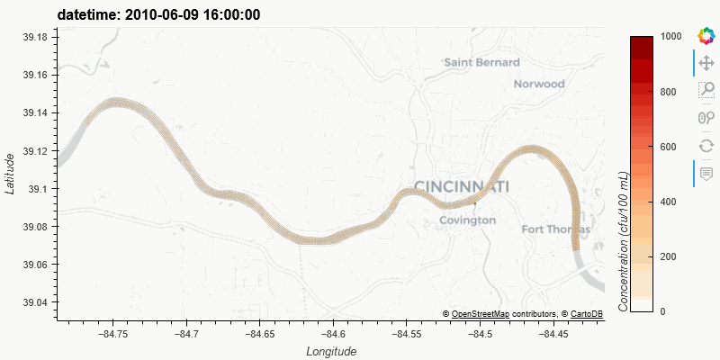

Getting Started
================

## Installation 

Clearwater Riverine is designed to run with **Python 3.10**. Detailed instructions on how to use `clearwater_riverine` package using `conda-develop` are included on the [Clearwater Riverine Github's readme](https://github.com/EnvironmentalSystems/ClearWater-riverine#readme). 

## Running a Clearwater Riverine Model

Note: Clearwater Riverine leverages HEC-RAS 2D model output to provide the model geometry and hydrodynamic information. HEC-RAS 2D model output (typically saved in an HDF file) is therefore required to run Clearwater Riverine. More detailed examples can be found on the [package Github repository](https://github.com/EnvironmentalSystems/ClearWater-riverine/tree/main/examples). 

Start by importing the clearwater module:

```python
import clearwater_riverine as cwr
```

You can then initialize your Clearwater Riverine model by providing the file path to your HEC-RAS 2D model and a diffusion coefficient value for your entire model domain. Here, we provide a HEC-RAS model of the Ohio River and a diffusion coefficient of 0.1:

```python
ohio_river_model = cwr.ClearwaterRiverine('examples/data/ohio_river/OhioRiver_m.p22.hdf', 0.1)
```

To set up water quality conditions required to run the model, users can define initial conditions and boundary conditions for their model from CSV files, like so:

```python
# initial conditions
ohio_river_model.initial_conditions('examples/data/ohio_river/cwr_initial_conditions.csv')

# boundary conditions
ohio_river_model.boundary_conditions('examples/data/ohio_river/cwr_boundary_conditions.csv')
```

Users can then run the Clearwater Riverine water quality model:

```python
ohio_river_model.simulate_wq(
    input_mass_units= 'cfu', 
    input_volume_units = '100 mL',
    input_liter_conversion = 0.1,
    save=True,
    output_file_path= 'ohio-river.zarr',
)
```

The Clearwater Riverine module also includes dynamic plotting functions, allowing users to interactively explore their results over the entire simulation horizon. All users have to do is call the `plot()` method, specifying the Coordinate Reference System (`crs`) of their HEC-RAS 2D model, and (optionally) the maximum value of the colorbar. 

```python
ohio_river_model.plot(
    crs='ESRI:102279', 
    clim_max = 500,
)
```
Example output:
